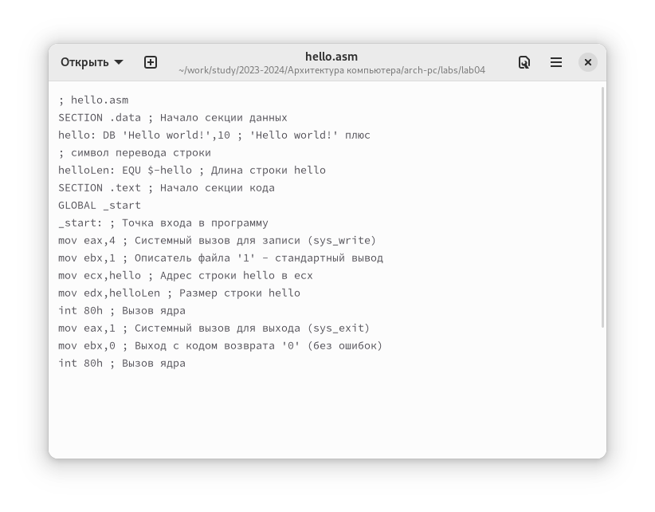
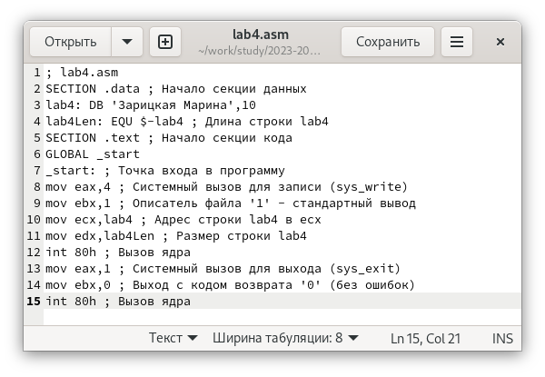

---
## Front matter
title: "Отчёт по лабораторной работе №4"
subtitle: "Дисциплина: Архитектура компьютера"
author: "Зарицкая Марина Петровна"

## Generic otions
lang: ru-RU
toc-title: "Содержание"

## Bibliography
bibliography: bib/cite.bib
csl: pandoc/csl/gost-r-7-0-5-2008-numeric.csl

## Pdf output format
toc: true # Table of contents
toc-depth: 2
lof: true # List of figures
fontsize: 12pt
linestretch: 1.5
papersize: a4
documentclass: scrreprt
## I18n polyglossia
polyglossia-lang:
  name: russian
  options:
	- spelling=modern
	- babelshorthands=true
polyglossia-otherlangs:
  name: english
## I18n babel
babel-lang: russian
babel-otherlangs: english
## Fonts
mainfont: PT Serif
romanfont: PT Serif
sansfont: PT Sans
monofont: PT Mono
mainfontoptions: Ligatures=TeX
romanfontoptions: Ligatures=TeX
sansfontoptions: Ligatures=TeX,Scale=MatchLowercase
monofontoptions: Scale=MatchLowercase,Scale=0.9
## Biblatex
biblatex: true
biblio-style: "gost-numeric"
biblatexoptions:
  - parentracker=true
  - backend=biber
  - hyperref=auto
  - language=auto
  - autolang=other*
  - citestyle=gost-numeric
## Pandoc-crossref LaTeX customization
figureTitle: "Рис."
listingTitle: "Листинг"
lofTitle: "Список иллюстраций"
lolTitle: "Листинги"
## Misc options
indent: true
header-includes:
  - \usepackage{indentfirst}
  - \usepackage{float} # keep figures where there are in the text
  - \floatplacement{figure}{H} # keep figures where there are in the text
---

# Цель работы

Освоение процедуры компиляции и сборки программ, написанных на ассемблере NASM.

# Задание

1. Создание программы Hello world!
2. Работа с транслятором NASM
3. Работа с расширенным синтаксисом командной строки NASM
4. Работа с компоновщиком LD
5. Запуск исполняемого файла
6. Выполнение заданий для самостоятельной работы.

# Теоретическое введение

Основными функциональными элементами любой ЭВМ являются центральный процессор, память и периферийные
устройства.
Взаимодействие этих устройств осуществляется через общую шину, к которой они подключены. Физически шина представляет собой большое количество проводников, соединяющих устройства друг с другом. В современных компьютерах проводники выполнены в виде электропроводящих дорожек на материнской плате.
Основной задачей процессора является обработка информации, а также организация координации всех узлов компьютера. В состав центрального процессора входят следующие устройства:
- арифметико-логическое устройство (АЛУ) — выполняет логические и арифметические действия, необходимые для обработки информации, хранящейся в памяти;
- устройство управления (УУ) — обеспечивает управление и контроль всех устройств компьютера;
- регистры — сверхбыстрая оперативная память небольшого объёма, входящая в состав процессора, для временного хранения промежуточных результатов выполнения инструкций; регистры процессора делятся на два типа: регистры общего назначения и специальные регистры.
Для того, чтобы писать программы на ассемблере, необходимо знать, какие регистры процессора существуют и как их можно использовать. Большинство команд в программах написанных на ассемблере используют регистры в каче-
стве операндов. Практически все команды представляют собой преобразование данных хранящихся в регистрах процессора, это например пересылка данных между регистрами или между регистрами и памятью, преобразование (арифметические или логические операции) данных хранящихся в регистрах.
Доступ к регистрам осуществляется не по адресам, как к основной памяти, а по именам. Каждый регистр процессора архитектуры x86 имеет свое название, состоящее из 2 или 3 букв латинского алфавита.
В качестве примера приведем названия основных регистров общего назначения (именно эти регистры чаще всего используются при написании программ):
- RAX, RCX, RDX, RBX, RSI, RDI — 64-битные
- EAX, ECX, EDX, EBX, ESI, EDI — 32-битные
- AX, CX, DX, BX, SI, DI — 16-битные
- AH, AL, CH, CL, DH, DL, BH, BL — 8-битные 

Другим важным узлом ЭВМ является оперативное запоминающее устройство (ОЗУ). ОЗУ — это быстродействующее энергозависимое запоминающее устройство, которое напрямую взаимодействует с узлами процессора, предназначенное для хранения программ и данных, с которыми процессор непосредственно работает в текущий момент. ОЗУ состоит из одинаковых пронумерованных ячеек памяти. Номер ячейки памяти — это адрес хранящихся в ней данных.
Периферийные устройства в составе ЭВМ:
- устройства внешней памяти, которые предназначены для долговременного хранения больших объёмов данных.
- устройства ввода-вывода, которые обеспечивают взаимодействие ЦП с внешней средой. 

В основе вычислительного процесса ЭВМ лежит принцип программного управления. Это означает, что компьютер решает поставленную задачу как последовательность действий, записанных в виде программы.

Коды команд представляют собой многоразрядные двоичные комбинации из 0 и 1. В коде машинной команды можно выделить две части: операционную и адресную. В операционной части хранится код команды, которую необходимо выполнить. В адресной части хранятся данные или адреса данных, которые участвуют в выполнении данной операции.
При выполнении каждой команды процессор выполняет определённую последовательность стандартных действий, которая называется командным циклом процессора. Он заключается в следующем:
1. формирование адреса в памяти очередной команды;
2. считывание кода команды из памяти и её дешифрация;
3. выполнение команды;
4. переход к следующей команде.

Язык ассемблера (assembly language, сокращённо asm) — машинно-ориентированный язык низкого уровня. 
NASM — это открытый проект ассемблера, версии которого доступны под различные операционные системы и который позволяет получать объектные файлы для этих систем. В NASM используется Intel-синтаксис и поддерживаются инструкции x86-64.

# Выполнение лабораторной работы
## Создание программы Hello world!

С помощью команды cd перемещаюсь в каталог, в котором буду работать (рис. -@fig:01).

{ #fig:01 width=70% }

Создаю в текущем каталоге пустой текстовый файл hello.asm, используя touch (рис. -@fig:002).

{ #fig:002 width=70% }

Открываю созданный файл в текстовом редакторе (рис. -@fig:003).

{ #fig:003 width=70% }

Ввожу в файл программу для вывода "Hello word!" (рис. -@fig:004).

{ #fig:004 width=70% }

## Работа с транслятором NASM

Компилирую текст программы для вывода "Hello world!" в объектный код с помощью транслятора NASM, далее проверяю правильность выполнения команды с помощью ls.(рис. -@fig:005)

{ #fig:005 width=70% }

## Работа с расширенным синтаксисом командной строки NASM

Выполняю команду, которая скомпилирует файл hello.asm в obj.o, при этом формат выходного файла будет elf, и в него будут включены символы для отладки (опция -g), кроме того, будет создан файл листинга list.lst (опция -l).
С помощью команды ls проверяю, что файлы были созданы.(рис. -@fig:006). 

{ #fig:006 width=70% }

## Работа с компоновщиком LD

Передаю объектный файл hello.o на обработку компоновщику LD, чтобы получить исполняемый файл hello. Затем с помощью ls проверяю, что исполняемый файл hello был создан (рис. -@fig:007). 

{ #fig:007 width=70% }

Выполняю следующую команду (рис. -@fig:008). Исполняемый файл будет иметь имя main, т.к. после ключа -о было задано значение main. Объектный файл, из которого собран этот исполняемый файл, имеет имя obj.o

{ #fig:008 width=70% }

## Запуск исполняемого файла

Запускаю на выполнение созданный исполняемый файл hello (рис. -@fig:009).

{ #fig:009 width=70% }

## Выполнение заданий для самостоятельной работы.

С помощью команды cp создаю в текущем каталоге копию файла hello.asm с именем lab4.asm. Проверяю с помощью ls (рис. -@fig:010).

{ #fig:010 width=70% }

С помощью текстового редактора gedit открываю файл lab4.asm и вношу изменения в программу так, чтобы вместо Hello world! на экран выводилась строка с моими
фамилией и именем. (рис. -@fig:011).

{ #fig:011 width=70% }

Транслирую текст программы в объектный файл и проверяю с помощью утилиты ls, что файл lab4.o создан. (рис. -@fig:012). 

{ #fig:012 width=70% }

Передаю объектный файл lab4.o на обработку компоновщику LD, чтобы получить исполняемый файл lab4 (рис. -@fig:013).

{ #fig:013 width=70% }

Запускаю исполняемый файл lab4, на экран действительно выводятся мои фамилия и имя (рис. -@fig:014).

{ #fig:014 width=70% }

Копирую файлы hello.asm и lab4.asm в свой локальный репозиторий в каталог ~/work/study/2023-2024/"Архитектура компьютера"/arch-pc/labs/lab04 (рис. -@fig:015).

{ #fig:015 width=70% }

С помощью команд git add . и git commit добавляю файлы на GitHub (рис. -@fig:016).

{ #fig:016 width=70% }

Отправляю файлы на сервер с помощью команды git push (рис. -@fig:017).

{ #fig:017 width=70% }

# Выводы

При выполнении данной лабораторной работы я освоила процедуры компиляции и сборки программ, написанных на ассемблере NASM.

