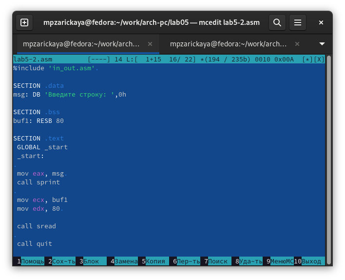

---
## Front matter
title: "Отчёт по лабораторной работе №5"
subtitle: "Дисциплина: Архитектура компьютера"
author: "Зарицкая Марина Петровна"

## Generic otions
lang: ru-RU
toc-title: "Содержание"

## Bibliography
bibliography: bib/cite.bib
csl: pandoc/csl/gost-r-7-0-5-2008-numeric.csl

## Pdf output format
toc: true # Table of contents
toc-depth: 2
lof: true # List of figures
lot: true # List of tables
fontsize: 12pt
linestretch: 1.5
papersize: a4
documentclass: scrreprt
## I18n polyglossia
polyglossia-lang:
  name: russian
  options:
	- spelling=modern
	- babelshorthands=true
polyglossia-otherlangs:
  name: english
## I18n babel
babel-lang: russian
babel-otherlangs: english
## Fonts
mainfont: PT Serif
romanfont: PT Serif
sansfont: PT Sans
monofont: PT Mono
mainfontoptions: Ligatures=TeX
romanfontoptions: Ligatures=TeX
sansfontoptions: Ligatures=TeX,Scale=MatchLowercase
monofontoptions: Scale=MatchLowercase,Scale=0.9
## Biblatex
biblatex: true
biblio-style: "gost-numeric"
biblatexoptions:
  - parentracker=true
  - backend=biber
  - hyperref=auto
  - language=auto
  - autolang=other*
  - citestyle=gost-numeric
## Pandoc-crossref LaTeX customization
figureTitle: "Рис."
tableTitle: "Таблица"
listingTitle: "Листинг"
lofTitle: "Список иллюстраций"
lotTitle: "Список таблиц"
lolTitle: "Листинги"
## Misc options
indent: true
header-includes:
  - \usepackage{indentfirst}
  - \usepackage{float} # keep figures where there are in the text
  - \floatplacement{figure}{H} # keep figures where there are in the text
---

# Цель работы

Приобретение практических навыков работы в Midnight Commander, освоение инструкций языка ассемблера mov и int.

# Задание

1. Основы работы с mc
2. Структура программы на языке ассемблера NASM
3. Подключение внешнего файла in_out.asm
4. Задание для самостоятельной работы

# Теоретическое введение

Midnight Commander (или просто mc) — это программа, которая позволяет просматривать структуру каталогов и выполнять основные операции по управлению файловой системой, т.е. mc является файловым менеджером. Midnight Commander позволяет сделать работу с файлами более удобной и наглядной.
Программа на языке ассемблера NASM, как правило, состоит из трёх секций: секция кода программы (SECTION .text), секция инициированных (известных во время компиляции) данных (SECTION .data) и секция неинициализированных данных (тех, под которые во время компиляции только отводится память, а значение присваивается в ходе выполнения программы) (SECTION .bss).
Для объявления инициированных данных в секции .data используются директивы DB, DW, DD, DQ и DT, которые резервируют память и указывают, какие значения должны храниться в этой памяти:
- DB (define byte) — определяет переменную размером в 1 байт;
- DW (define word) — определяет переменную размеров в 2 байта (слово);
- DD (define double word) — определяет переменную размером в 4 байта (двойное слово);
- DQ (define quad word) — определяет переменную размером в 8 байт (учетве-
рённое слово);
- DT (define ten bytes) — определяет переменную размером в 10 байт. Директивы используются для объявления простых переменных и для объявления массивов. Для определения строк принято использовать директиву DB в связи с особенностями хранения данных в оперативной памяти.
Инструкция языка ассемблера mov предназначена для дублирования данных источника в приёмнике. 
```NASM
mov dst,src
```
Здесь операнд dst — приёмник, а src — источник.
В качестве операнда могут выступать регистры (register), ячейки памяти (memory) и непосредственные значения (const).
Инструкция языка ассемблера int предназначена для вызова прерывания с
указанным номером. 
```NASM
int n
```
Здесь n — номер прерывания, принадлежащий диапазону 0–255. При программировании в Linux с использованием вызовов ядра sys_calls n=80h (принято задавать в шестнадцатеричной системе счисления).

# Выполнение лабораторной работы
## Основы работы с Midnight Commander

Открываю Midnight Commander с помощью команды mc (рис. @fig:001).

{#fig:001 width=70%}

Перехожу в каталог ~/work/arch-pc созданный при выполнении лабораторной работы №4. С помощью функциональной клавиши F7 создаю каталог lab05 (рис. @fig:002).

{#fig:002 width=70%}

Пользуясь строкой ввода и командой touch создаю файл lab5-1.asm (рис. @fig:003).

{#fig:003 width=70%}

## Структура программы на языке ассемблера NASM

С помощью функциональной клавиши F4 открываю созданный файл для редактирования в редакторе mcedit. Ввожу в файл код программы вывода сообщения на экран и ввода строки с клавиатуры, сохраняю изменения и закрываю файл (рис. @fig:004).

{#fig:004 width=70%}

С помощью функциональной клавиши F3 открываю файл для просмотра, чтобы проверить, содержит ли файл текст программы (рис. @fig:005).

{#fig:005 width=70%}

Транслирую текст программы файла в объектный файл командой nasm -f elf lab5-1.asm (рис. @fig:006).

{#fig:006 width=70%}

Выполняю компоновку объектного файла (рис. @fig:007).

{#fig:007 width=70%}

Запускаю исполняемый файл. Программа выводит строку "Введите строку: " и ждет ввода с клавиатуры, я ввожу свои ФИО и программа заканчивает свою работу (рис. @fig:008).

{#fig:008 width=70%}

## Подключение внешнего файла in_out.asm

Скачиваю файл in_out.asm со страницы курса в ТУИС. С помощью функциональной клавиши F5 копирую файл из каталога Загрузки в созданный каталог lab05 (рис. @fig:009).

{#fig:009 width=70%}

С помощью функциональной клавиши F5 создаю копию файла lab5-1.asm с именем
lab5-2.asm (рис. @fig:010).

{#fig:010 width=70%}

Изменяю содержимое файла lab5-2.asm во встроенном редакторе mcedit так, чтобы в программе использовались подпрограммы из внешнего файла in_out.asm (рис. @fig:011).

{#fig:011 width=70%}

Транслирую текст программы файла в объектный файл командой nasm -f elf lab5-2.asm. Создался объектный файл lab5-2.o. Выполняю компоновку объектного файла с помощью команды ld -m elf_i386 -o lab5-2 lab5-2.o Создался исполняемый файл lab5-2. Запускаю исполняемый файл (рис. @fig:012). 

{#fig:012 width=70%}

Изменяю в файле lab5-2.asm подпрограмму sprintLF на sprint. Сохраняю изменения и открываю файл для просмотра, чтобы проверить сохранение действий (рис. @fig:013).

{#fig:013 width=70%}

Транслирую файл, выполняю компоновку созданного объектного файла, запускаю программу (рис. @fig:014).

{#fig:014 width=70%}

Различие между первым и вторым исполняемыми файлами в том, что запуск первого запрашивает ввод с новой строки, а второго запрашивает ввод без переноса на новую строку. В этом и заключается разница между подпрограммами sprintLF и sprint.

## Задание для самостоятельной работы

1. Создаю копию файла lab5-1.asm с именем lab5-1-1.asm с помощью функциональной клавиши F5 (рис. @fig:015).

{#fig:015 width=70%}

Открываю созданный файл в mcedit для редактирования. Изменяю программу так, чтобы кроме вывода приглашения и запроса ввода, она выводила вводимую пользователем строку (рис. @fig:016). 

{#fig:016 width=70%}

2. Создаю объектный файл lab5-1-1.o, отдаю его на обработку компоновщику, получаю исполняемый файл lab5-1-1, запускаю полученный исполняемый файл. Программа запрашивает ввод, ввожу свои ФИО, далее программа выводит введенные мною данные (рис. @fig:017).
 
{#fig:017 width=70%}

Листинг первой программы:

```NASM
SECTION .data
msg: DB 'Введите строку:',10

msgLen: EQU $-msg

SECTION .bss
buf1: RESB 80

SECTION .text
GLOBAL _start
 _start:
 
 mov eax, 4
 mov ebx, 1
 mov ecx, msg
 mov edx, msgLen
 int 80h
 
 mov eax, 3
 mov ebx, 0
 mov ecx, buf1
 mov edx, 80
 int 80h
 
 mov eax, 4
 mov ebx, 1
 mov ecx, buf1
 mov edx, buf1
 int 80h
 
 mov eax, 1
 mov ebx, 0
 int 80h
```

3. Создаю копию файла lab5-2.asm с именем lab5-2-1.asm с помощью функциональной клавиши F5 (рис. @fig:018).

{#fig:018 width=70%}

Открываю созданный файл в mcedit для редактирования. Изменяю программу так, чтобы кроме вывода приглашения и запроса ввода, она выводила вводимую пользователем строку (рис. @fig:019). 

{#fig:019 width=70%}

4. Создаю объектный файл lab5-2-1.o, отдаю его на обработку компоновщику, получаю исполняемый файл lab5-2-1, запускаю полученный исполняемый файл. Программа запрашивает ввод без переноса на новую строку, ввожу свои ФИО, далее программа выводит введенные мною данные (рис. @fig:020).

{#fig:020 width=70%}

Листинг второй программы:

```NASM
%include 'in_out.asm' 

SECTION .data
msg: DB 'Введите строку: ',0h

SECTION .bss
buf1: RESB 80

SECTION .text
 GLOBAL _start
 _start:
 
 mov eax, msg 
 call sprint
 
 mov ecx, buf1
 mov edx, 80 

 call sread
 
 mov eax, 4
 mov ebx, 1
 mov ecx, buf1
 int 80h
 
 call quit
```

# Выводы

При выполнении данной лабораторной работы я приобрела практические навыки работы в Midnight Commander, а также освоила инструкции языка ассемблера mov и int.

