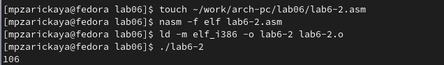

---
## Front matter
title: "Отчёт по лабораторной работе №6"
subtitle: "Дисциплина: Архитектура компьютера"
author: "Зарицкая Марина Петровна"

## Generic otions
lang: ru-RU
toc-title: "Содержание"

## Bibliography
bibliography: bib/cite.bib
csl: pandoc/csl/gost-r-7-0-5-2008-numeric.csl

## Pdf output format
toc: true # Table of contents
toc-depth: 2
lof: true # List of figures
lot: true # List of tables
fontsize: 12pt
linestretch: 1.5
papersize: a4
documentclass: scrreprt
## I18n polyglossia
polyglossia-lang:
  name: russian
  options:
	- spelling=modern
	- babelshorthands=true
polyglossia-otherlangs:
  name: english
## I18n babel
babel-lang: russian
babel-otherlangs: english
## Fonts
mainfont: PT Serif
romanfont: PT Serif
sansfont: PT Sans
monofont: PT Mono
mainfontoptions: Ligatures=TeX
romanfontoptions: Ligatures=TeX
sansfontoptions: Ligatures=TeX,Scale=MatchLowercase
monofontoptions: Scale=MatchLowercase,Scale=0.9
## Biblatex
biblatex: true
biblio-style: "gost-numeric"
biblatexoptions:
  - parentracker=true
  - backend=biber
  - hyperref=auto
  - language=auto
  - autolang=other*
  - citestyle=gost-numeric
## Pandoc-crossref LaTeX customization
figureTitle: "Рис."
tableTitle: "Таблица"
listingTitle: "Листинг"
lofTitle: "Список иллюстраций"
lotTitle: "Список таблиц"
lolTitle: "Листинги"
## Misc options
indent: true
header-includes:
  - \usepackage{indentfirst}
  - \usepackage{float} # keep figures where there are in the text
  - \floatplacement{figure}{H} # keep figures where there are in the text
---

# Цель работы

Освоение арифметических инструкций языка ассемблера NASM.

# Задание

1. Символьные и численные данные в NASM
2. Выполнение арифметических операций в NASM
3. Выполнение заданий для самостоятельной работы

# Теоретическое введение

Большинство инструкций на языке ассемблера требуют обработки операндов. Адрес операнда предоставляет место, где хранятся данные, подлежащие обработке. Это могут быть данные хранящиеся в регистре или в ячейке памяти.

• Регистровая адресация – операнды хранятся в регистрах и в команде используются
имена этих регистров, например: mov ax,bx.

• Непосредственная адресация – значение операнда задается непосредственно в команде, Например: mov ax,2.

• Адресация памяти – операнд задает адрес в памяти. В команде указывается символическое обозначение ячейки памяти, над содержимым которой требуется выполнить
операцию.

Ввод информации с клавиатуры и вывод её на экран осуществляется в символьном виде. Кодирование этой информации производится согласно кодовой таблице символов ASCII. ASCII – сокращение от American Standard Code for Information Interchange (Американский стандартный код для обмена информацией). Согласно стандарту ASCII каждый символ кодируется одним байтом.
Среди инструкций NASM нет такой, которая выводит числа (не в символьном виде). Поэтому, например, чтобы вывести число, надо предварительно преобразовать его цифры в ASCII-коды этих цифр и выводить на экран эти коды, а не само число. Если же выводить число на экран непосредственно, то экран воспримет его не как число, а как последовательность ASCII-символов – каждый байт числа будет воспринят как один ASCII-символ – и выведет на экран эти символы.
Аналогичная ситуация происходит и при вводе данных с клавиатуры. Введенные данные будут представлять собой символы, что сделает невозможным получение корректного результата при выполнении над ними арифметических операций.
Для решения этой проблемы необходимо проводить преобразование ASCII символов в числа и обратно.

# Выполнение лабораторной работы

## Символьные и численные данные в NASM

Создала каталог для программ лабораторной работы №6, перешла в него и
создала файл lab6-1.asm (рис. @fig:001).

{#fig:001 width=70%}

Ввела в файл lab6-1.asm текст программы из листинга 6.1 (рис. @fig:002).

{#fig:002 width=70%}

Создала исполняемый файл и запустила его. Программа вывела символ j (рис. @fig:003).

{#fig:003 width=70%}

Изменила текст программы (Листинг 6.1) следующим образом: заменила строки

```NASM
mov eax,'6'
mov ebx,'4'
```
на строки

```NASM
mov eax,6
mov ebx,4
```
(рис. @fig:004).

{#fig:004 width=70%}

Создала исполняемый файл и запустила его. Результат программы - символ с кодом 10, это символ перевода строки и он не отображается при выводе на экран (рис. @fig:005).

{#fig:005 width=70%}

Затем я создала файл lab6-2.asm в каталоге ~/work/arch-pc/lab06 и ввела в него текст программы из листинга 6.2 (рис. @fig:006).

{#fig:006 width=70%}

Запустила созданный исполняемый файл (рис. @fig:007).

{#fig:007 width=70%}

В результате работы программы мы получим число 106. В данном случае, как и в первом,
команда add складывает коды символов ‘6’ и ‘4’ (54+52=106). Однако, в отличии от программы
из листинга 6.1, функция iprintLF позволяет вывести число, а не символ, кодом которого
является это число.

Аналогично предыдущему примеру заменила строки программы

```NASM
mov eax,'6'
mov ebx,'4'
```
на строки

```NASM
mov eax,6
mov ebx,4
```
(рис. @fig:008).

{#fig:008 width=70%}

Создала и запустила новый исполняемый файл. Теперь программа складывает не соответствующие символам коды в системе ASCII, а сами числа, поэтому вывод 10 (рис. @fig:009).

{#fig:009 width=70%}

Изменила функцию iprintLF на iprint в тексте программы (рис. @fig:010).

{#fig:010 width=70%}

Затем создала и запустила исполняемый файл. В результате работы программы так же выводится число 10, но уже без переноса строки, за который отвечает функция iprintLF (рис. @fig:011). 

{#fig:011 width=70%}

## Выполнение арифметических операций в NASM

Создала файл lab6-3.asm в каталоге ~/work/arch-pc/lab06 (рис. @fig:012). 

{#fig:012 width=70%}

Ввела текст программы из листинга 6.3 в файл lab6-3.asm (рис. @fig:013). 

{#fig:013 width=70%}

Создала и запустила исполняемый файл (рис. @fig:014). 

{#fig:014 width=70%}

Изменила программу так, чтобы она вычисляла значение выражения f(x) = (4 * 6 + 2)/5 (рис. @fig:015).

{#fig:015 width=70%}

Создала и запустила новый исполняемый файл (рис. @fig:016). 

{#fig:016 width=70%}

Создала файл variant.asm с помощью утилиты touch (рис. @fig:017). 

{#fig:017 width=70%}

Ввела в файл текст программы из листинга 6.4 (рис. @fig:018). 

{#fig:018 width=70%}

Создала исполняемый файл и запустила программу. Ввела номер своего студенческого билета и получила номер своего варианта - 7 (рис. @fig:019). Проверила правильность выполнения, вычислив номер варианта аналитически.

{#fig:019 width=70%}

1. За вывод сообщения "Ваш вариант" отвечают строки кода:

```NASM
mov eax,rem
call sprint
```
2. Инструкция mov ecx, x используется, чтобы положить адрес вводимой строки x в регистр ecx
mov edx, 80 - запись в регистр edx длины вводимой строки
call sread - вызов подпрограммы из внешнего файла, обеспечивающей ввод сообщения с клавиатуры.

3. call atoi используется для вызова подпрограммы из внешнего файла, которая преобразует ASCII-код символа в целое число и записывает результат в регистр eax.

4. За вычисления варианта отвечают строки:

```NASM
xor edx,edx ; обнуление edx для корректной работы div
mov ebx,20 ; ebx = 20
div ebx ; eax = eax/20, edx - остаток от деления
inc edx ; edx = edx + 1
```
5. При выполнении инструкции div ebx остаток от деления записывается в регистр edx.

6. Инструкция inc edx увеличивает значение регистра edx на 1

7. За вывод на экран результатов вычислений отвечают строки:

```NASM
mov eax,edx
call iprintLF
```
## Выполнение заданий для самостоятельной работы

Создала файл zadanie.asm. Открыла его для редактирования, ввела в него текст программы для вычисления значения выражения 5(x − 1)^2 в соответствии со своим вариантом (рис. @fig:020). 

{#fig:020 width=70%}

Создала и запустила исполняемый файл. При вводе значения 3 на входе вывод программы - 20. При вводе значения 5 программа выводит результат 80. Программа работает верно (рис. @fig:021).

{#fig:021 width=70%}

**Листинг программы для вычисления значения выражения 5(x − 1)^2 (вариант 7)**

```NASM
%include 'in_out.asm' ; подключение внешнего файла
SECTION .data ; секция инициированных данных
msg: DB 'Введите значение переменной х: ',0
rem: DB 'Результат: ',0

SECTION .bss ; секция не инициированных данных
x: RESB 80 ; Переменная, значение к-рой будем вводить с клавиатуры, выделенный размер - 80 байт

SECTION .text ; Код программы
GLOBAL _start ; Начало программы
_start: ; Точка входа в программу

; ---- Вычисление выражения
mov eax, msg ; запись адреса выводимиого сообщения в eax
call sprint ; вызов подпрограммы печати сообщения
mov ecx, x ; запись адреса переменной в ecx
mov edx, 80 ; запись длины вводимого значения в edx
call sread ; вызов подпрограммы ввода сообщения

mov eax,x ; вызов подпрограммы преобразования
call atoi ; ASCII кода в число, `eax=x`
sub eax,1; eax = eax-1 = x - 1
mov ebx, eax ; запись значения (x-1) в регистр ebx 
mul ebx; eax = eax*ebx = (x-1)*(x-1)
mov ecx,5 ; запись значения 5 в регистр ecx
mul ecx; eax=eax*ecx = (x-1)*(x-1)*5
mov edi,eax ; запись результата вычисления в 'edi'

; ---- Вывод результата на экран
mov eax,rem ; вызов подпрограммы печати
call sprintLF ; сообщения 'Результат: '
mov eax,edi ; вызов подпрограммы печати значения
call iprintLF ; из 'edi' в виде символов
call quit ; вызов подпрограммы завершения
```

# Выводы

При выполнении данной лабораторной работы я освоила арифметические инструкции языка ассемблера NASM.

# Список литературы{.unnumbered}

(https://esystem.rudn.ru/mod/resource/view.php?id=1030554)
